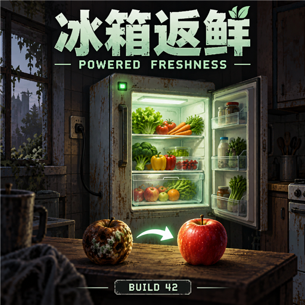

# 冰箱返鲜 / Powered Freshness

为 Project Zomboid 42.20.4 制作的 Mod：食物在通电冰箱或冰柜里，按沙盒设定的常温腐败速度逐渐返鲜，可从变质恢复为陈腐，再恢复为新鲜。冷藏和冷冻返鲜等速。



版本：0.1.0，目标游戏 **42.20.4**，前置 **ZombieBuddy 2.3.2**。本仓库提供源码、测试与构建脚本，不上传发行包；实际完成的验证及其边界见 `docs/verification.md`。

实现依据：Project Zomboid 42.20.4 游戏 API、ZombieBuddy 2.3.2 开发文档，以及 `docs/research.md` 中的一手资料。

## 怎么使用

把仍然存在的易腐食品放进通电冰箱或冰柜，随游戏时间逐渐恢复：**变质 → 陈腐 → 新鲜**。成为新鲜后仍会继续恢复，直到腐败值为零。冰箱里的背包也会检查。

- 沙盒腐败速度越快，返鲜也越快；冷藏与冻结不会降低返鲜速度。
- 断电或拿出后恢复原版食物处理。暂停或关闭游戏不累计现实时间返鲜。
- 保留温度、冻结、生熟和固有毒性；焦糊、毒蘑菇等不会因此变成安全食品。
- 只作用于引擎识别为冰箱或冰柜的容器。仅有冰箱外观、实际为普通储物容器的第三方物品不自动适用。
- 已被游戏删除、转化为其他物品或食用的食品无法恢复。不会凭空生成食品。

## 腐败值与返鲜速度

游戏用 `Age` 记录食品的腐败值，单位是累计的等效腐败天数，并不是统一的 0–100 百分比。每种食品有自己的两个阈值。

| 中文状态 | 普通易腐食品的判断 |
| --- | --- |
| 新鲜 | 腐败值小于该食品的新鲜期限 `OffAge` |
| 陈腐 | 腐败值达到新鲜期限，但未达到变质期限 `OffAgeMax` |
| 变质 | 腐败值达到或超过变质期限 |

受精蛋等原版特殊物品仍遵循自己的判断。本 Mod 不改原版中文状态名称。

| 沙盒腐败速度 | 通电满 24 个游戏小时减少的腐败值 |
| --- | ---: |
| 非常快 | 1.7 天 |
| 快 | 1.4 天 |
| 正常 | 1 天 |
| 慢 | 0.7 天 |
| 非常慢 | 0.4 天 |

例如正常速度下，某食品的新鲜期限为 3 天、变质期限为 7 天，当前腐败值为 8 天：通电保存超过 1 个游戏日后回到陈腐，超过 5 个游戏日后回到新鲜，满 8 个游戏日归零。实际阈值随食品种类而异。

## 安装

已发布至 [Steam 创意工坊：冰箱返鲜 / Powered Freshness（3800777834）](https://steamcommunity.com/sharedfiles/filedetails/?id=3800777834)。本 GitHub 仓库只发布源码、文档和封面素材，不提供安装包或 GitHub Release。也可按下方“验证与源码”运行构建脚本，取得 `dist` 中的安装 ZIP。

Steam 已将 ZombieBuddy 列为本 Mod 的必需物品；Java loader 仍需按作者流程手动安装。

1. 订阅 [ZombieBuddy（3619862853）](https://steamcommunity.com/sharedfiles/filedetails/?id=3619862853)，并按[作者安装说明](https://github.com/zed-0xff/ZombieBuddy/blob/master/doc/Installation.md) 部署 **2.3.2**。Windows 需手动下载并运行[作者安装器](https://github.com/zed-0xff/ZombieBuddy/releases/tag/windows_installer) `ZombieBuddyInstaller.exe`，选择 `Install or update ZombieBuddy`，再选择 `Both` 为常规和备用启动接入 Java loader，或只选实际使用的启动方式。核对修改预览，按安装器当时的提示操作；若它要求修改 Steam 启动项时退出 Steam，再按提示退出。启动后检查主菜单显示 `ZombieBuddy v2.3.2 loaded`；仅订阅前置不够。
2. 订阅上述 Powered Freshness 并等待 Steam 下载完成。若使用本地 ZIP，将其中的 `PoweredFreshness` 整个目录放到游戏缓存的 `mods` 目录，Windows 默认目标为 `%USERPROFILE%\Zomboid\mods\PoweredFreshness`，目录下面应直接有 `common` 和 `42`。选择一种安装方式，避免同名本地版和工坊版重复。
3. 在 Mod 列表启用 `ZombieBuddy` 和 `PoweredFreshness`。已有存档还应在该存档的 Mod 管理中启用。
4. 首次加载新的 Java JAR 时，ZombieBuddy 会显示自己的批准对话框；核对名称和 SHA-256 后按其正常流程批准。更新 JAR 后会重新询问。
5. 进入世界，日志应包含 `[PoweredFreshness] 0.1.0 installed` 和 `[PoweredFreshness] Active; authority=true`。客户端显示 `authority=false`。如果显示 `DISABLED` 或 Java 扩展缺失，返鲜没有启用。

安装包不包含游戏或 ZombieBuddy 的 JAR。本项目的构建和验证不会自动安装到现有游戏目录。

## 多人

房主服务器／独立服务器和每一位客户端都需要相同版本的本 Mod 与 ZombieBuddy **2.3.2**。使用工坊版时，在服务器工坊物品列表中加入 ZombieBuddy `3619862853` 和 Powered Freshness `3800777834`；`Mods` 列表包含 `ZombieBuddy`、`PoweredFreshness`。保留原有列表，并按所用 B42 管理界面的格式添加。使用本地 ZIP 时，分别复制到服务器实际缓存目录和各客户端。服务器和每位客户端仍需按前置作者流程接入 Java loader，并分别完成首次 JAR 审批；工坊下载不能代办这些步骤。

服务器负责返鲜，客户端接收年龄结果。物品移动、重新连接和刚打开容器时可能短暂显示旧值，随后刷新。房主自己的客户端加载了前置，不代表房主启动的服务器也加载了；应分别检查日志。Windows 服务器／房主的 Java 启动接入方法以 [前置官方说明](https://github.com/zed-0xff/ZombieBuddy/blob/master/doc/Installation.md) 为准。

远处原版市电与发电机的供电历史会补算。对于尚未完成原版燃料／损坏补算的远处发电机，食品先保留待结算记录，待来源重新加载并完成补算后应用结果。第三方电源只采用已加载期间观察到的供电时间，不声称支持其离线燃料模型。

## 验证与源码

- `docs/verification.md`：本次测试、未验证范围和复现入口。
- `docs/design.md`：功能规则与接入设计。
- `docs/research.md`：一手资料与本机核查。
- `docs/friend-installation.md`：给玩家的安装步骤。
- `src/main`、`src/test`、`mod`：Java 源码、测试和 Lua 桥。

在装有 JDK 25 的 PowerShell 中，于源码目录运行：

```powershell
./scripts/Build.ps1 -GameDirectory '你的游戏目录'
```

脚本也能通过 Steam 库自动发现游戏；可用 `PZ_GAME_DIR`、`ZOMBIEBUDDY_JAR` 环境变量指定编译依赖。运行所有测试后，在 `dist` 生成新的安装 ZIP，在 `build/latest-result.json` 记录依赖、成品 SHA-256 和实际通过的测试。源码不会下载新依赖。

## English

**Powered Freshness 0.1.0** targets **Project Zomboid 42.20.4** with **ZombieBuddy 2.3.2**. Powered engine-recognized refrigerators and freezers reverse perishable food age at the sandbox room-temperature spoilage rate. Rotten food can become stale and then fresh; age stops at zero. Refrigeration and freezing do not slow recovery. Temperature, freezing, cooking and intrinsic poison remain under vanilla control. Game time, not real-world offline time, determines recovery.

Published on [Steam Workshop: Powered Freshness (3800777834)](https://steamcommunity.com/sharedfiles/filedetails/?id=3800777834). This GitHub repository contains source, documentation and cover artwork; it provides no installation packages or GitHub Releases. Subscribe to the Workshop item and [ZombieBuddy (3619862853)](https://steamcommunity.com/sharedfiles/filedetails/?id=3619862853), or build the source and copy the ZIP's entire `PoweredFreshness` folder into the game's cache `mods` directory. Use one installation method to avoid duplicate copies.

Steam now lists ZombieBuddy as a required item for this mod; its Java loader still requires manual installation following the author's instructions.

ZombieBuddy **2.3.2's Java loader requires manual setup**. Follow the [author's installation guide](https://github.com/zed-0xff/ZombieBuddy/blob/master/doc/Installation.md). On Windows, run [the author's installer](https://github.com/zed-0xff/ZombieBuddy/releases/tag/windows_installer), `ZombieBuddyInstaller.exe`, choose `Install or update ZombieBuddy`, then `Both` for Normal and Alternate Launch or only the launch mode you use. Review the proposed changes and follow its prompts; close Steam if requested when changing launch options. Check for `ZombieBuddy v2.3.2 loaded` in the main menu. Subscription alone is insufficient.

Install matching mod and dependency versions on every server/host and client. Enable both mods, including in existing save settings, and complete ZombieBuddy's Java approval process separately for the server and clients. Workshop servers need item IDs `3619862853` and `3800777834`, plus Mod IDs `ZombieBuddy` and `PoweredFreshness`, preserving existing entries. The server calculates recovery and sends ordered age snapshots to clients. Check server and client logs separately; installing the client loader does not install it for the server's Java launch environment.

Native unloaded generator intervals wait for the game's own fuel/condition accounting before being applied. Third-party power sources are supported only for observed loaded time. Deleted or replaced food cannot be recreated. Tests and the exact runtime-validation boundary are documented in `docs/verification.md`; automated checks do not constitute a real multiplayer playtest.

Build from source using JDK 25 and `./scripts/Build.ps1 -GameDirectory '<game directory>'`. Game and framework JARs are compile-only dependencies and are never redistributed. The project is MIT-licensed; third-party software retains its own terms.

本项目代码、测试、文档及工坊封面由 AI 根据用户要求生成，代码、测试和文档经过 AI 审查，以 MIT 许可证开放。This project's code, tests, documentation and Workshop cover were generated by AI under user direction; the code, tests and documentation were also reviewed by AI. 游戏和第三方框架属于各自权利人；不随本项目分发。见 `LICENSE`、`THIRD_PARTY_NOTICES.md` 和 [封面生成记录](assets/workshop/generation.md)。
